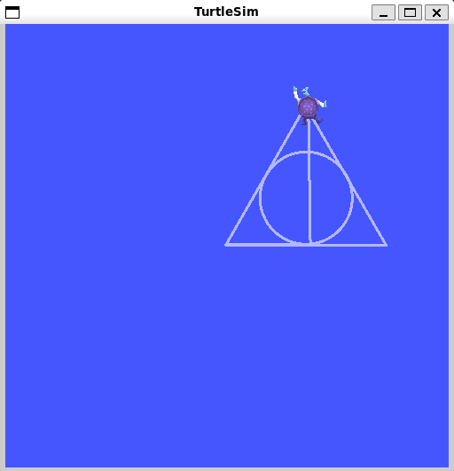

# `gos_aec_turtlesim` package
ROS 2 python package.  [](https://docs.ros.org/en/humble/)
## Packages and build

It is assumed that the workspace is `~/ros2_ws/`.
A package egy node-ból áll, ez a turtlesim szimulátorban képes egy 'Deathly Hallows' szimbólum kirajzolására.
Megvalósítás ROS2 Humble alatt.

### Clone the packages
``` r
cd ~/ros2_ws/src
```
``` r
git clone https://github.com/GosiKrisztian/gos_aec_turtlesim
```

### Build ROS 2 packages
``` r
cd ~/ros2_ws
```
``` r
colcon build --packages-select gos_aec_turtlesim --symlink-install
```

<details>
<summary> Don't forget to source before ROS commands.</summary>

``` bash
source ~/ros2_ws/install/setup.bash
```
</details>

``` r
ros2 launch gos_aec_turtlesim launch_example1.launch.py
```



